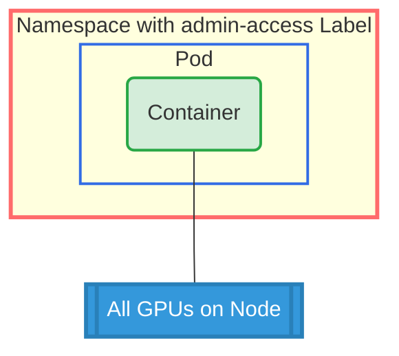

# DRA Admin Access Example

## Overview

This example demonstrates the DRA Admin Access feature with the `DRA_ADMIN_ACCESS` environment variable. It shows how privileged workloads can access all devices on a node for administrative purposes like maintenance, monitoring, or diagnostics.
For more information about admin access in DRA, see https://kubernetes.io/docs/concepts/scheduling-eviction/dynamic-resource-allocation/#admin-access

**Setup**: One namespace with admin access label. One pod with one container requesting all GPUs with admin access using `allocationMode: All`.

**Key Requirements**:

- The namespace must have the label: `resource.kubernetes.io/admin-access: "true"`
- The request must set `adminAccess: true`
- `allocationMode: All` is used to access all available GPUs on a node (admins typically require access to all devices to perform maintenance or monitoring)

## GPU Allocation



## Requirements

### Driver Requirements

- **Profile**: gpu
- **GPUs**: All available on a node (uses allocationMode: All)

### Cluster Requirements

- Kubernetes 1.34+
- Feature gate: `DRAAdminAccess` enabled

## How to Run

1. Apply the example:

   ```bash
   cd demo/examples/admin-access && kubectl apply -f admin-access.yaml
   ```

2. Verify the pod is running:

   ```bash
   kubectl get pods -n admin-access
   ```

3. Check admin access and GPU allocation:

   ```bash
   # Check DRA_ADMIN_ACCESS flag
   kubectl logs -n admin-access pod0 -c ctr0 | grep DRA_ADMIN_ACCESS

   # Check all GPU devices
   kubectl logs -n admin-access pod0 -c ctr0 | grep GPU_DEVICE
   ```

## Expected Output

The container should have:

- `DRA_ADMIN_ACCESS=true` environment variable
- `GPU_DEVICE` environment variables for **all available GPUs** on the node

Example output:

```bash
=== DRA Admin Access Demo ===
DRA Admin Access: true

GPU Environment Variables:
GPU_DEVICE_0=gpu-0
GPU_DEVICE_1=gpu-1
GPU_DEVICE_2=gpu-2
GPU_DEVICE_3=gpu-3
GPU_DEVICE_4=gpu-4
GPU_DEVICE_5=gpu-5
GPU_DEVICE_6=gpu-6
GPU_DEVICE_7=gpu-7

=== Sleeping to allow inspection ===
```

## Cleanup

```bash
cd demo/examples/admin-access && kubectl delete -f admin-access.yaml
```
