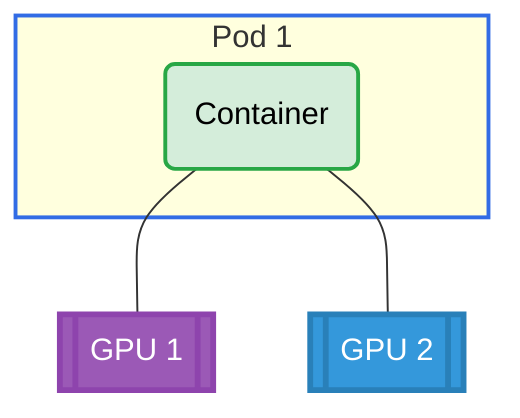

# Basic Multiple Requests Example

## Overview

This example demonstrates how a single container can request two distinct GPUs through a single ResourceClaimTemplate with two device requests.

**Setup**: One pod with one container requesting 2 distinct GPUs.

## GPU Allocation



## Requirements

### Driver Requirements

- **Profile**: gpu
- **GPUs**: 2

### Cluster Requirements

- Kubernetes 1.34+

## How to Run

1. Apply the example:

   ```bash
   cd demo/examples/basic-multiple-requests && kubectl apply -f basic-multiple-requests.yaml
   ```

2. Verify the pod is running:

   ```bash
   kubectl get pods -n basic-multiple-requests
   ```

3. Check GPU allocation:
   ```bash
   kubectl logs -n basic-multiple-requests pod0 -c ctr0 | grep GPU_DEVICE
   ```

## Expected Output

The container should have 2 `GPU_DEVICE` environment variables with distinct GPU IDs, confirming that the single container received two different GPUs.

Example output:

```
GPU_DEVICE_0=gpu-0
GPU_DEVICE_1=gpu-1
```

## Cleanup

```bash
cd demo/examples/basic-multiple-requests && kubectl delete -f basic-multiple-requests.yaml
```
