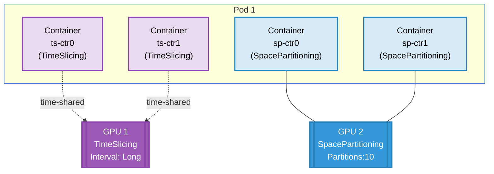

# Basic ResourceClaim with Opaque Config Example

## Overview

This example demonstrates advanced GPU configuration using opaque parameters in DRA. It shows how to configure different sharing strategies (TimeSlicing and SpacePartitioning) for different GPUs within the same pod.

**Setup**: One pod with four containers sharing two GPUs, each GPU configured with a different sharing strategy.
- **GPU 1: TimeSlicing Configuration**

   - **Strategy**: TimeSlicing
   - **Interval**: Long
   - **Containers**: ts-ctr0, ts-ctr1
   - **Behavior**: Containers take turns accessing the GPU with long time slices

- **GPU 2: SpacePartitioning Configuration**

   - **Strategy**: SpacePartitioning
   - **Partition Count**: 10
   - **Containers**: sp-ctr0, sp-ctr1
   - **Behavior**: Each container gets dedicated partition(s) of the GPU

## GPU Allocation



## Requirements

### Driver Requirements

- **Profile**: gpu
- **GPUs**: 2 (minimum)

### Cluster Requirements

- Kubernetes 1.34+

## How to Run

1. Apply the example:

   ```bash
   cd demo/examples/basic-resourceclaim-opaque-config && kubectl apply -f basic-resourceclaim-opaque-config.yaml
   ```

2. Verify the pod is running:

   ```bash
   kubectl get pods -n basic-resourceclaim-opaque-config
   ```

3. Check GPU allocation and configuration for TimeSlicing containers:

   ```bash
   kubectl logs -n basic-resourceclaim-opaque-config pod0 -c ts-ctr0 | grep -E "GPU_DEVICE|SHARING_STRATEGY|TIMESLICE_INTERVAL"
   kubectl logs -n basic-resourceclaim-opaque-config pod0 -c ts-ctr1 | grep -E "GPU_DEVICE|SHARING_STRATEGY|TIMESLICE_INTERVAL"
   ```

4. Check GPU allocation and configuration for SpacePartitioning containers:
   ```bash
   kubectl logs -n basic-resourceclaim-opaque-config pod0 -c sp-ctr0 | grep -E "GPU_DEVICE|SHARING_STRATEGY|PARTITION_COUNT"
   kubectl logs -n basic-resourceclaim-opaque-config pod0 -c sp-ctr1 | grep -E "GPU_DEVICE|SHARING_STRATEGY|PARTITION_COUNT"
   ```

## Expected Output

### TimeSlicing Containers (ts-ctr0 and ts-ctr1)

Both containers should show:

```
GPU_DEVICE_0=gpu-X
SHARING_STRATEGY=TimeSlicing
TIMESLICE_INTERVAL=Long
```

- Both containers share the **same GPU ID**
- They take turns using the GPU with long time intervals

### SpacePartitioning Containers (sp-ctr0 and sp-ctr1)

Both containers should show:

```
GPU_DEVICE_0=gpu-Y
SHARING_STRATEGY=SpacePartitioning
PARTITION_COUNT=10
```

- Both containers share the **same GPU ID** (different from TimeSlicing GPU)
- Each container gets dedicated partition(s) from the 10 available partitions

## Cleanup

```bash
cd demo/examples/basic-resourceclaim-opaque-config && kubectl delete -f basic-resourceclaim-opaque-config.yaml
```
