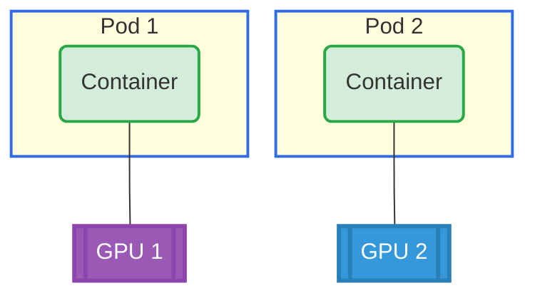

# Basic ResourceClaimTemplate Example

## Overview

This example demonstrates the simplest use case of Dynamic Resource Allocation (DRA): two pods, each requesting one GPU through a ResourceClaimTemplate.

**Setup**: Two pods, each with one container requesting 1 distinct GPU.

## GPU Allocation



## Requirements

### Driver Requirements

- **Profile**: gpu
- **GPUs**: 2

### Cluster Requirements

- Kubernetes 1.34+

## How to Run

1. Apply the example:

   ```bash
   cd demo/examples/basic-resourceclaimtemplate && kubectl apply -f basic-resourceclaimtemplate.yaml
   ```

2. Verify the pods are running:

   ```bash
   kubectl get pods -n basic-resourceclaimtemplate
   ```

3. Check GPU allocation for each pod:
   ```bash
   kubectl logs -n basic-resourceclaimtemplate pod0 -c ctr0 | grep GPU_DEVICE
   kubectl logs -n basic-resourceclaimtemplate pod1 -c ctr0 | grep GPU_DEVICE
   ```

## Expected Output

Each container should have 1 `GPU_DEVICE` environment variable with a distinct GPU ID, confirming that each pod received a different GPU.

## Cleanup

```bash
cd demo/examples/basic-resourceclaimtemplate && kubectl delete -f basic-resourceclaimtemplate.yaml
```
