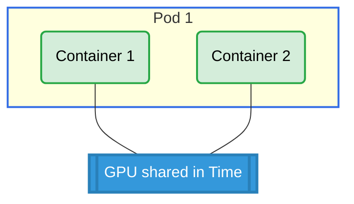

# Basic Shared Claim Across Containers Example

## Overview

This example demonstrates GPU sharing between multiple containers within the same pod. Both containers reference the same ResourceClaim, allowing them to share access to a single GPU.

**Setup**: One pod with two containers sharing access to a single GPU.

## GPU Allocation



## Requirements

### Driver Requirements

- **Profile**: gpu
- **GPUs**: 1

### Cluster Requirements

- Kubernetes 1.34+

## How to Run

1. Apply the example:

   ```bash
   cd demo/examples/basic-shared-claim-across-containers && kubectl apply -f basic-shared-claim-across-containers.yaml
   ```

2. Verify the pod is running:

   ```bash
   kubectl get pods -n basic-shared-claim-across-containers
   ```

3. Check GPU allocation for both containers:
   ```bash
   kubectl logs -n basic-shared-claim-across-containers pod0 -c ctr0 | grep GPU_DEVICE
   kubectl logs -n basic-shared-claim-across-containers pod0 -c ctr1 | grep GPU_DEVICE
   ```

## Expected Output

Both containers should show the same GPU ID, confirming they are sharing access to the same GPU.

Example output:

```
# Container ctr0
GPU_DEVICE_0=gpu-0

# Container ctr1
GPU_DEVICE_0=gpu-0
```

## Cleanup

```bash
cd demo/examples/basic-shared-claim-across-containers && kubectl delete -f basic-shared-claim-across-containers.yaml
```
