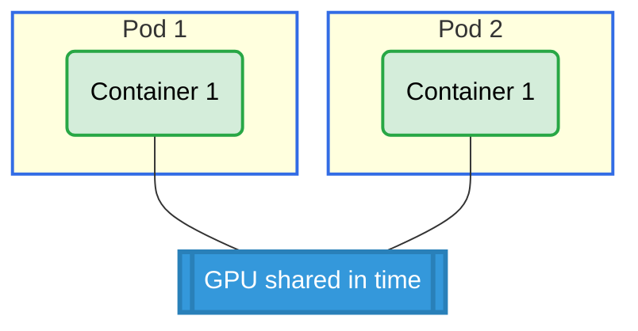

# Basic Shared Claim Across Pods Example

## Overview

This example demonstrates GPU sharing between multiple pods using a standalone ResourceClaim. Unlike ResourceClaimTemplate which creates a new claim per pod, this uses a single ResourceClaim that multiple pods can reference.

**Setup**: Two pods, each with one container, sharing access to a single GPU via a standalone ResourceClaim.

## What This Example Shows

- How to use a standalone `ResourceClaim` (not a template)
- Multiple pods sharing access to the same GPU
- Cross-pod resource sharing

## GPU Allocation



## Requirements

### Driver Requirements
- **Profile**: gpu
- **GPUs**: 1

### Cluster Requirements
- Kubernetes 1.34+
- DRA feature gates enabled

## How to Run

1. Apply the example:
   ```bash
   cd demo/examples/basic-shared-claim-across-pods && kubectl apply -f basic-shared-claim-across-pods.yaml
   ```

2. Verify both pods are running:
   ```bash
   kubectl get pods -n basic-shared-claim-across-pods
   ```

3. Check GPU allocation for both pods:
   ```bash
   kubectl logs -n basic-shared-claim-across-pods pod0 -c ctr0 | grep GPU_DEVICE
   kubectl logs -n basic-shared-claim-across-pods pod1 -c ctr0 | grep GPU_DEVICE
   ```

## Expected Output

Both pods should show the same GPU ID, confirming they are sharing access to the same GPU.

Example output:
```
# Pod pod0
GPU_DEVICE_0=gpu-0

# Pod pod1
GPU_DEVICE_0=gpu-0
```

## Cleanup

```bash
cd demo/examples/basic-shared-claim-across-pods && kubectl delete -f basic-shared-claim-across-pods.yaml
```
