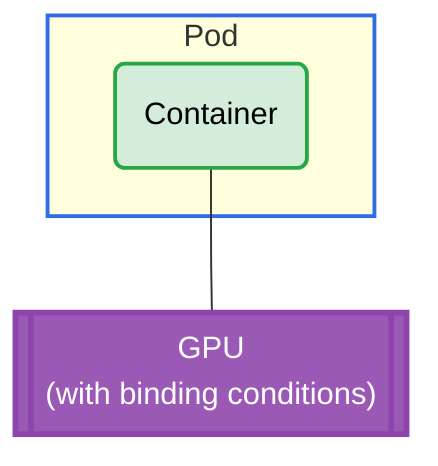

# Device Binding Conditions Example

## Overview

This example demonstrates the DRA Device Binding Conditions feature, which allows drivers to declare conditions that must be met before a device is considered fully bound and ready for use. When enabled, each GPU device in the `ResourceSlice` is published with `bindingConditions` and `bindingFailureConditions` lists that the scheduler uses to track the binding lifecycle of allocated devices.

For more information about device binding conditions in DRA, see https://kubernetes.io/docs/concepts/scheduling-eviction/dynamic-resource-allocation/#device-binding-conditions

**Setup**: One pod with one container requesting 1 GPU. The driver publishes binding conditions, and a controller plugin automatically satisfies them before the pod starts.

## GPU Allocation



## Requirements

### Driver Requirements

- **Profile**: gpu
- **GPUs**: 1
- **Binding Conditions**: Enabled via `kubeletPlugin.bindingConditions=true`
- **Controller Plugin**: BindingConditions plugin enabled via `controller.plugins={BindingConditions}`

### Cluster Requirements

- Kubernetes 1.34+
- Feature gate: `DRADeviceBindingConditions` enabled

**Note**: The demo Kind cluster configuration (`demo/scripts/kind-cluster-config.yaml`) already includes this feature gate.

## How to Run

### 1. Install the Driver with Binding Conditions Enabled

Binding conditions require two settings: `kubeletPlugin.bindingConditions` to publish binding conditions in the `ResourceSlice`, and `controller.plugins={BindingConditions}` to deploy the controller that automatically satisfies them:

```bash
helm upgrade -i \
  --create-namespace \
  --namespace dra-example-driver \
  --set kubeletPlugin.bindingConditions=true \
  --set controller.plugins={BindingConditions} \
  dra-example-driver \
  deployments/helm/dra-example-driver
```

### 2. Verify the ResourceSlice

After installing the driver, inspect the `ResourceSlice` to confirm that devices are published with binding condition fields:

```bash
kubectl get resourceslice -o yaml
```

Each device should contain:

```yaml
bindingConditions:
- BindingConditions
bindingFailureConditions:
- BindingFailureConditions
```

### 3. Apply the Example

```bash
cd demo/examples/binding-conditions && kubectl apply -f binding-conditions.yaml
```

### 4. Verify the Pod is Running

The `BindingConditions` controller plugin automatically watches allocated `ResourceClaim` objects and satisfies binding conditions, so the pod transitions from `Pending` to `Running` shortly after creation:

```bash
kubectl get pods -n binding-conditions
```

### 5. Check Binding Conditions Status

Verify that the `ResourceClaim` has been allocated and that `status.devices` contains the `BindingConditions` condition set to `True`:

```bash
kubectl get resourceclaim -n binding-conditions
```

View the detailed ResourceClaim status:

```bash
kubectl get resourceclaim -n binding-conditions -o yaml
```

## Expected Output

The pod should be running successfully:

```console
$ kubectl get pod -n binding-conditions
NAME   READY   STATUS    RESTARTS   AGE
pod0   1/1     Running   0          30s
```

The ResourceClaim should show allocated and reserved state:

```console
$ kubectl get resourceclaim -n binding-conditions
NAME             STATE                AGE
pod0-gpu-xxxxx   allocated,reserved   30s
```

The ResourceClaim status should include the satisfied binding condition:

```yaml
status:
  allocation:
    devices:
      results:
      - bindingConditions:
        - BindingConditions
        bindingFailureConditions:
        - BindingFailureConditions
        device: gpu-0
        driver: gpu.example.com
        pool: dra-example-driver-cluster-worker
        request: gpu
  devices:
  - conditions:
    - lastTransitionTime: "2026-05-15T14:00:00Z"
      message: Device is ready
      reason: Ready
      status: "True"
      type: BindingConditions
    device: gpu-0
    driver: gpu.example.com
    pool: dra-example-driver-cluster-worker
  reservedFor:
  - name: pod0
    resource: pods
```

## Cleanup

```bash
cd demo/examples/binding-conditions && kubectl delete -f binding-conditions.yaml
```

