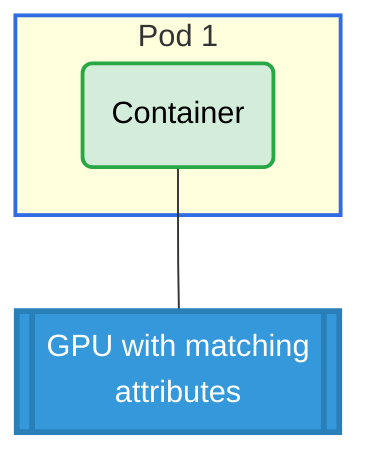

# CEL Expression Selectors Example

## Overview

This example demonstrates how to use Common Expression Language (CEL) selectors to specify device requirements beyond simple DeviceClass matching. It shows how to select GPUs based on specific attributes like model and memory capacity.

**Setup**: One pod with one container using CEL expression selectors to request a GPU with specific attributes.

## GPU Allocation



## Requirements

### Driver Requirements
- **Profile**: gpu
- **GPUs**: 1 (with model='LATEST-GPU-MODEL' and memory >= 4Gi)

### Cluster Requirements
- Kubernetes 1.34+

## How to Run

1. Apply the example:
   ```bash
   cd demo/examples/cel-selector && kubectl apply -f cel-selector.yaml
   ```

2. Verify the pod is running:
   ```bash
   kubectl get pods -n cel-selector
   ```

3. Check GPU allocation:
   ```bash
   kubectl logs -n cel-selector pod0 -c ctr0 | grep GPU_DEVICE
   ```

## Expected Output

The container should have 1 `GPU_DEVICE` environment variable with a GPU that matches the CEL constraints:
- Model: `LATEST-GPU-MODEL`
- Memory: At least 4Gi

## Cleanup

```bash
cd demo/examples/cel-selector && kubectl delete -f cel-selector.yaml
```
