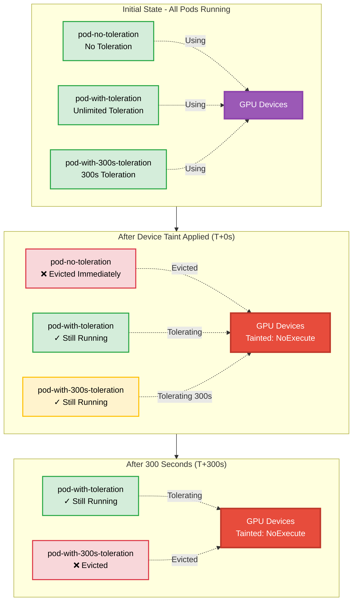

# Device Taint Configurable Pod Eviction Time Example

## Overview

This example demonstrates how to configure toleration duration using `tolerationSeconds` in Dynamic Resource Allocation (DRA). When a device taint with `NoExecute` effect is applied, pods can specify how long they can tolerate the taint before being evicted. This allows for graceful handling of device issues with configurable grace periods.

**Setup**: Three pods with different toleration configurations:
1. No toleration - immediate eviction
2. Unlimited toleration - never evicted
3. Time-limited toleration (300s) - evicted after 5 minutes

## Device Taint Toleration Duration Behavior



## Requirements

### Driver Requirements

- **Profile**: gpu
- **GPUs**: 3+
- **Feature**: Device Taint Manager enabled

### Cluster Requirements

- **Kubernetes Version**: 1.35+
- **API Version**: `resource.k8s.io/v1beta2` must be enabled
- **Feature Gates** (must be enabled):
  - [`DRADeviceTaints`](https://kubernetes.io/docs/reference/command-line-tools-reference/feature-gates/#DRADeviceTaints): Enables device taints and tolerations for DRA
  - [`DRADeviceTaintRules`](https://kubernetes.io/docs/reference/command-line-tools-reference/feature-gates/#DRADeviceTaintRules): Enables DeviceTaintRule API for managing device taints
- **kube-apiserver Configuration**:
  - Add `--runtime-config=resource.k8s.io/v1beta2=true` to enable the v1beta2 API version
  - Reference: [kube-apiserver runtime-config](https://kubernetes.io/docs/reference/command-line-tools-reference/kube-apiserver/)

For more information about device taints and tolerations, see the [Kubernetes documentation](https://kubernetes.io/docs/concepts/scheduling-eviction/dynamic-resource-allocation/#device-taints-and-tolerations).

## How to Run

### Step 1: Create Pods with Different Tolerations

```bash
kubectl create -f 1-basic-resourceclaimtemplate.yaml
```

**Expected Output:**
```
namespace/basic-resourceclaimtemplate created
resourceclaimtemplate.resource.k8s.io/single-gpu-without-toleration created
resourceclaimtemplate.resource.k8s.io/single-gpu-with-toleration created
resourceclaimtemplate.resource.k8s.io/single-gpu-with-300s-toleration created
pod/pod-no-toleration created
pod/pod-with-toleration created
pod/pod-with-300s-toleration created
```

### Step 2: Verify All Pods Are Running

```bash
kubectl get pods -n basic-resourceclaimtemplate
```

**Expected Output:**
```
NAME                       READY   STATUS    RESTARTS   AGE
pod-no-toleration          1/1     Running   0          6s
pod-with-300s-toleration   1/1     Running   0          6s
pod-with-toleration        1/1     Running   0          6s
```

**Events at this stage:**
```
TYPE     REASON      OBJECT                         MESSAGE
Normal   Scheduled   pod/pod-no-toleration          Successfully assigned basic-resourceclaimtemplate/pod-no-toleration to taint-tolerate-worker2
Normal   Pulled      pod/pod-no-toleration          Container image "ubuntu:22.04" already present on machine
Normal   Created     pod/pod-no-toleration          Container created
Normal   Started     pod/pod-no-toleration          Container started
Normal   Scheduled   pod/pod-with-300s-toleration   Successfully assigned basic-resourceclaimtemplate/pod-with-300s-toleration to taint-tolerate-worker
Normal   Pulled      pod/pod-with-300s-toleration   Container image "ubuntu:22.04" already present on machine
Normal   Created     pod/pod-with-300s-toleration   Container created
Normal   Started     pod/pod-with-300s-toleration   Container started
Normal   Scheduled   pod/pod-with-toleration        Successfully assigned basic-resourceclaimtemplate/pod-with-toleration to taint-tolerate-worker
Normal   Pulled      pod/pod-with-toleration        Container image "ubuntu:22.04" already present on machine
Normal   Created     pod/pod-with-toleration        Container created
Normal   Started     pod/pod-with-toleration        Container started
```

### Step 3: Apply Device Taint Rule

```bash
kubectl create -f 2-device-taint-rule.yaml
```

**Expected Output:**
```
devicetaintrule.resource.k8s.io/example created
```

### Step 4: Observe Immediate Eviction

Immediately after applying the taint, the pod without toleration is evicted:

```bash
kubectl get pods -n basic-resourceclaimtemplate
```

**Expected Output:**
```
NAME                       READY   STATUS    RESTARTS   AGE
pod-with-300s-toleration   1/1     Running   0          21s
pod-with-toleration        1/1     Running   0          21s
```

**Additional Events:**
```
TYPE     REASON                       OBJECT                    MESSAGE
Normal   DeviceTaintManagerEviction   pod/pod-no-toleration     Marking for deletion
Normal   Killing                      pod/pod-no-toleration     Stopping container ctr0
```

### Step 5: Check DeviceTaintRule Status

```bash
kubectl get devicetaintrule -o yaml
```

**Status shows eviction in progress:**
```yaml
status:
  conditions:
  - lastTransitionTime: "2026-07-08T06:40:21Z"
    message: 1 pod needs to be evicted in 1 namespace. 1 pod evicted since starting the controller.
    observedGeneration: 1
    reason: PodsPendingEviction
    status: "True"
    type: EvictionInProgress
```

### Step 6: Wait for 300 Seconds

After 300 seconds (5 minutes), the pod with time-limited toleration is evicted:

```bash
kubectl get pods -n basic-resourceclaimtemplate
```

**Expected Output:**
```
NAME                  READY   STATUS    RESTARTS   AGE
pod-with-toleration   1/1     Running   0          5m50s
```

**Additional Events:**
```
TYPE     REASON                       OBJECT                         MESSAGE
Normal   DeviceTaintManagerEviction   pod/pod-with-300s-toleration   Marking for deletion
Normal   Killing                      pod/pod-with-300s-toleration   Stopping container ctr0
```

### Step 7: Verify Final DeviceTaintRule Status

```bash
kubectl get devicetaintrule -o yaml
```

**Status shows all evictions completed:**
```yaml
status:
  conditions:
  - lastTransitionTime: "2026-07-08T06:45:21Z"
    message: 2 pods evicted since starting the controller.
    observedGeneration: 1
    reason: Completed
    status: "False"
    type: EvictionInProgress
```

## Pod Behavior Summary

### Pod 1: pod-no-toleration
- **Toleration**: None
- **Behavior**: Evicted immediately when taint is applied
- **Eviction Time**: ~10 seconds after taint application
- **Final State**: Terminated

### Pod 2: pod-with-toleration
- **Toleration**: Unlimited (no `tolerationSeconds`)
  ```yaml
  tolerations:
  - key: gpu.example.com/unhealthy
    operator: Equal
    value: "true"
    effect: NoExecute
  ```
- **Behavior**: Continues running indefinitely despite the taint
- **Final State**: Running

### Pod 3: pod-with-300s-toleration
- **Toleration**: 300 seconds
  ```yaml
  tolerations:
  - key: gpu.example.com/unhealthy
    operator: Equal
    value: "true"
    effect: NoExecute
    tolerationSeconds: 300
  ```
- **Behavior**: Tolerates the taint for 300 seconds, then evicted
- **Eviction Time**: Exactly 300 seconds after taint application
- **Final State**: Terminated

## Event Timeline

```
Event
------
All 3 pods created and running
DeviceTaintRule applied
pod-no-toleration: Marked for deletion (immediate eviction)
pod-no-toleration: Container killed
pod-with-300s-toleration: Marked for deletion (300s elapsed)
pod-with-300s-toleration: Container killed
pod-with-toleration: Still running
```

## Cleanup

```bash
kubectl delete -f 2-device-taint-rule.yaml
kubectl delete -f 1-basic-resourceclaimtemplate.yaml
```