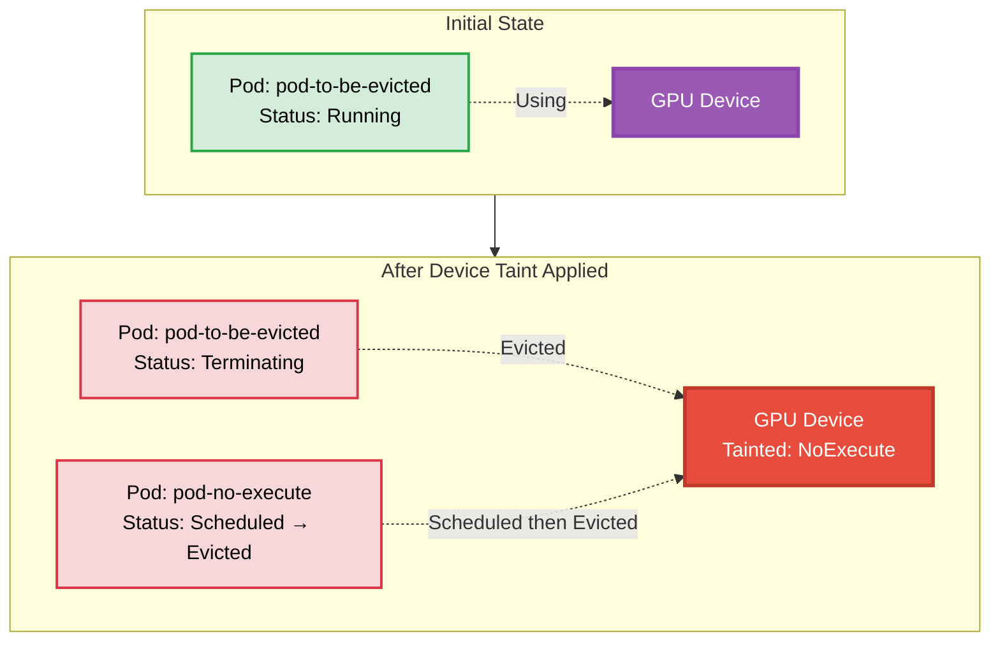

# Device Taint Pod NoExecute Example

## Overview

This example demonstrates how device taints with the `NoExecute` effect work in Dynamic Resource Allocation (DRA). When a device taint with `NoExecute` effect is applied, the pods using the tainted device are evicted unless they have the matching tolerations.

**Setup**: Two pods requesting GPUs without tolerations, followed by applying a device taint rule with `NoExecute` effect.

## Device Taint Behavior



## Requirements

### Driver Requirements

- **Profile**: gpu
- **GPUs**: 1+
- **Feature**: Device Taint Manager enabled

### Cluster Requirements

- **Kubernetes Version**: 1.35+
- **API Version**: `resource.k8s.io/v1beta2` must be enabled
- **Feature Gates** (must be enabled):
  - [`DRADeviceTaints`](https://kubernetes.io/docs/reference/command-line-tools-reference/feature-gates/#DRADeviceTaints): Enables device taints and tolerations for DRA
  - [`DRADeviceTaintRules`](https://kubernetes.io/docs/reference/command-line-tools-reference/feature-gates/#DRADeviceTaintRules): Enables DeviceTaintRule API for managing device taints
- **kube-apiserver Configuration**:
  - Add `--runtime-config=resource.k8s.io/v1beta2=true` to enable the v1beta2 API version
  - Reference: [kube-apiserver runtime-config](https://kubernetes.io/docs/reference/command-line-tools-reference/kube-apiserver/)

For more information about device taints and tolerations, see the [Kubernetes documentation](https://kubernetes.io/docs/concepts/scheduling-eviction/dynamic-resource-allocation/#device-taints-and-tolerations).

## How to Run

1. Apply the ResourceClaimTemplate:

   ```bash
   kubectl apply -f 1-basic-resourceclaimtemplate.yaml
   ```

2. Create the first pod (will run successfully):

   ```bash
   kubectl apply -f 2-pod-to-be-evicted.yaml
   ```

3. Verify the pod is running:

   ```bash
   kubectl get pods -n basic-resourceclaimtemplate
   ```

4. Apply the device taint rule with `NoExecute` effect:

   ```bash
   kubectl apply -f 3-device-taint-rule.yaml
   ```

5. Observe the pod being evicted:

   ```bash
   kubectl get events -n basic-resourceclaimtemplate
   ```

6. Create a second pod after the taint is applied:

   ```bash
   kubectl apply -f 4-pod-no-execute.yaml
   ```

## Expected Behavior

### Pod 1 (pod-to-be-evicted)
- **Initial State**: Successfully scheduled and running on a node
- **After Taint Applied**: Device Taint Manager marks it for deletion
- **Final State**: Pod is killed and terminated

### Pod 2 (pod-no-execute)
- **Initial State**: Created after device taint is applied
- **Scheduling**: Successfully assigned to a node
- **Execution**: Immediately marked for deletion by Device Taint Manager
- **Final State**: Never runs, gets evicted right after scheduling

## Event Timeline

```
Event order
----    -----
pod-to-be-evicted: Scheduled to taint-tolerate-worker
pod-to-be-evicted: Container started, Running
Device Taint Rule applied (NoExecute effect)
pod-to-be-evicted: DeviceTaintManagerEviction - Marking for deletion
pod-to-be-evicted: Killing container
pod-no-execute: Scheduled to taint-tolerate-worker
pod-no-execute: DeviceTaintManagerEviction - Marking for deletion (immediately)
```

## Cleanup

```bash
kubectl delete -f 4-pod-no-execute.yaml
kubectl delete -f 3-device-taint-rule.yaml
kubectl delete -f 2-pod-to-be-evicted.yaml
kubectl delete -f 1-basic-resourceclaimtemplate.yaml
```