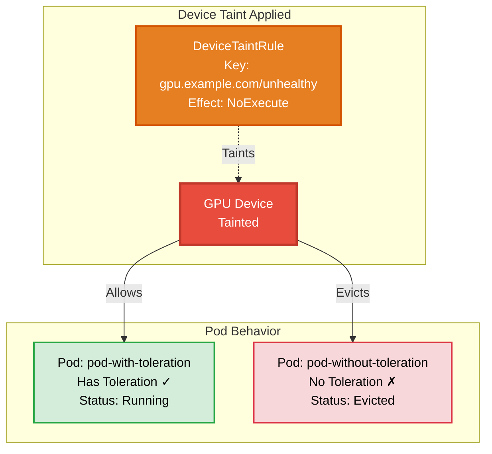

# Device Taint Pod Toleration Example

## Overview

This example demonstrates how device tolerations work in Dynamic Resource Allocation (DRA). When a device taint with `NoExecute` effect is applied, only pods with matching tolerations can continue using the tainted devices. Pods without tolerations are immediately evicted by the Device Taint Manager.

**Setup**: Two pods requesting GPUs - one with toleration and one without - both created after a device taint rule is applied.

## Device Taint Toleration Behavior



## Requirements

### Driver Requirements

- **Profile**: gpu
- **GPUs**: 2+
- **Feature**: Device Taint Manager enabled

### Cluster Requirements

- **Kubernetes Version**: 1.35+
- **API Version**: `resource.k8s.io/v1beta2` must be enabled
- **Feature Gates** (must be enabled):
  - [`DRADeviceTaints`](https://kubernetes.io/docs/reference/command-line-tools-reference/feature-gates/#DRADeviceTaints): Enables device taints and tolerations for DRA
  - [`DRADeviceTaintRules`](https://kubernetes.io/docs/reference/command-line-tools-reference/feature-gates/#DRADeviceTaintRules): Enables DeviceTaintRule API for managing device taints
- **kube-apiserver Configuration**:
  - Add `--runtime-config=resource.k8s.io/v1beta2=true` to enable the v1beta2 API version
  - Reference: [kube-apiserver runtime-config](https://kubernetes.io/docs/reference/command-line-tools-reference/kube-apiserver/)

For more information about device taints and tolerations, see the [Kubernetes documentation](https://kubernetes.io/docs/concepts/scheduling-eviction/dynamic-resource-allocation/#device-taints-and-tolerations).

## How to Run

1. Apply the device taint rule first:

   ```bash
   kubectl apply -f 1-device-taint-rule.yaml
   ```

2. Verify the device taint rule is created:

   ```bash
   kubectl get devicetaintrule -o yaml
   ```

3. Apply the ResourceClaimTemplates and pods:

   ```bash
   kubectl apply -f 2-basic-resourceclaimtemplate.yaml
   ```

4. Observe the pod behavior:

   ```bash
   kubectl get pods -n basic-resourceclaimtemplate -w
   ```

5. Check the events:

   ```bash
   kubectl get events -n basic-resourceclaimtemplate
   ```

## Expected Behavior

### Pod with Toleration (pod-with-toleration)
- **ResourceClaimTemplate**: Includes toleration matching the device taint
  ```yaml
  tolerations:
  - key: gpu.example.com/unhealthy
    operator: Equal
    value: "true"
    effect: NoExecute
  ```
- **Scheduling**: Successfully assigned to a node
- **Execution**: Container starts and continues running
- **Final State**: Remains running despite the device taint

### Pod without Toleration (pod-without-toleration)
- **ResourceClaimTemplate**: No toleration specified
- **Scheduling**: Successfully assigned to a node
- **Execution**: Container starts briefly
- **Eviction**: Device Taint Manager marks it for deletion
- **Final State**: Pod is killed and terminated

## Event Timeline

```
Event
----   
DeviceTaintRule applied (NoExecute effect)
Device Taint Manager processes the rule
pod-with-toleration: Scheduled to taint-tolerate-worker2
pod-without-toleration: Scheduled to taint-tolerate-worker
pod-with-toleration: Container started, Running ✓
pod-without-toleration: Container started
pod-without-toleration: DeviceTaintManagerEviction - Marking for deletion
pod-without-toleration: Killing container
```

## DeviceTaintRule Status

The DeviceTaintRule tracks eviction activity:

```yaml
status:
  conditions:
  - lastTransitionTime: "2026-07-08T05:10:07Z"
    message: 1 pod evicted since starting the controller.
    observedGeneration: 1
    reason: Completed
    status: "False"
    type: EvictionInProgress
```

## Toleration Configuration

To allow a pod to use tainted devices, add tolerations to the ResourceClaimTemplate:

```yaml
spec:
  spec:
    devices:
      requests:
      - name: gpu
        exactly:
          deviceClassName: gpu.example.com
          tolerations:
          - key: gpu.example.com/unhealthy
            operator: Equal
            value: "true"
            effect: NoExecute
```

### Toleration Fields
- **key**: Must match the taint key
- **operator**: `Equal` (value must match) or `Exists` (any value)
- **value**: Must match the taint value when operator is `Equal`
- **effect**: Must match the taint effect (`NoExecute`, `NoSchedule`, etc.)

## Cleanup

```bash
kubectl delete -f 2-basic-resourceclaimtemplate.yaml
kubectl delete -f 1-device-taint-rule.yaml
```
