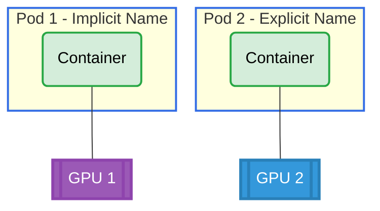

# Extended Resource Request Example (KEP-5004)

## Overview

This example demonstrates the Extended Resource Request feature (KEP-5004), which allows pods to request DRA-managed devices using the traditional `resources.limits` API instead of explicit ResourceClaims. The scheduler dynamically allocates devices from the DRA driver.

**Setup**: Two pods, each with one container requesting GPUs using the classic resources.limits API:
- **Pod 0**: Uses implicit name `deviceclass.resource.kubernetes.io/<className>` (works with default chart install)
- **Pod 1**: Uses explicit name `example.com/gpu` (requires chart install with `--set deviceClass.extendedResourceName=example.com/gpu`)

## GPU Allocation



## Requirements

### Driver Requirements
- **Profile**: gpu
- **GPUs**: 2

### Cluster Requirements
- Kubernetes 1.34+
- Feature gate: `DRAExtendedResource` enabled

## How to Run

### Pod 0 (Implicit Name - Works with Default Chart)

1. Apply pod0:
   ```bash
   cd demo/examples/extended-resource-request && kubectl apply -f extended-resource-request.yaml
   ```

2. Verify pod0 is running:
   ```bash
   kubectl get pod -n extended-resource-request pod0
   ```

3. Check GPU allocation:
   ```bash
   kubectl logs -n extended-resource-request pod0 -c ctr0 | grep GPU_DEVICE
   ```

4. Check allocation status:
   ```bash
   kubectl get pod -n extended-resource-request pod0 \
     -o jsonpath='{.status.extendedResourceClaimStatus}'
   ```

### Pod 1 (Explicit Name - Requires Chart Configuration)

Pod1 requires the Helm chart to be installed with: **--set deviceClass.extendedResourceName=example.com/gpu**


Without this configuration, pod1 will remain in Pending state while pod0 runs normally.

## Expected Output

Each pod should get one GPU. The scheduler records the allocation in `pod.status.extendedResourceClaimStatus`.

Example output:
```bash
# Pod logs
GPU_DEVICE_0=gpu-0

# Pod status
{
  "extendedResourceClaimStatus": [
    {
      "name": "deviceclass.resource.kubernetes.io/gpu.example.com",
      "resourceClaimName": "pod0-deviceclass.resource.kubernetes.io-gpu.example.com-0"
    }
  ]
}
```

## Cleanup

```bash
cd demo/examples/extended-resource-request && kubectl delete -f extended-resource-request.yaml
```
