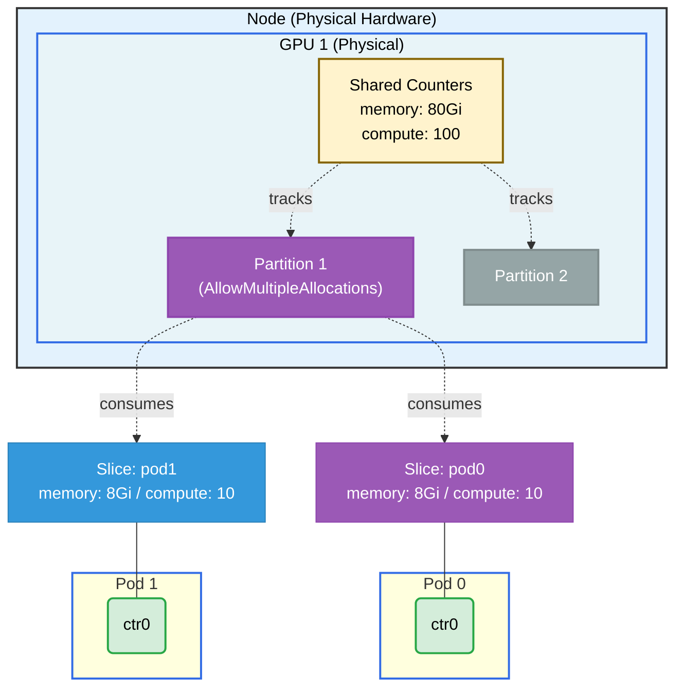

# GPU Allow Multiple Allocations — Partitionable Example

## Overview

This example combines two features: **DRAConsumableCapacity** (multiple allocations) and **DRAPartitionableDevices** (partition slices). Two pods each request a slice of a partition device's `memory` and `compute` counters. The partition devices share counters with the physical GPU, so the scheduler can track that the consumed capacity comes from the same physical hardware.

**Setup**: Two pods, each with one container, each consuming 8Gi memory and 10 compute units from a GPU partition device.

## What This Example Shows

- How `AllowMultipleAllocations` and partitionable devices work together
- Using `capacity.requests` on a partition device to consume fine-grained slices
- Both `DRAConsumableCapacity` and `DRAPartitionableDevices` feature gates in practice

## GPU Allocation



## Requirements

### Driver Requirements

- **Profile**: gpu
- **GPUs**: 1
- Helm values: `gpuAllowMultipleAllocations=true` and `kubeletPlugin.gpuPartitions > 0`

### Cluster Requirements

- Kubernetes 1.35+ with both feature gates enabled:
  - `DRAConsumableCapacity` (Alpha in 1.35, enabled by default in 1.36+)
  - `DRAPartitionableDevices` (Alpha in 1.35, enabled by default in 1.36+)

## Prerequisites

Install the driver with both features enabled:

```bash
helm upgrade -i \
  --create-namespace \
  --namespace dra-example-driver \
  --set gpuAllowMultipleAllocations=true \
  --set kubeletPlugin.gpuPartitions=4 \
  dra-example-driver \
  deployments/helm/dra-example-driver
```

## Verification

### Check ResourceSlices

You should see two slices per node — one for shared counters and one for partition devices (with `AllowMultipleAllocations` set on at least one partition):

```bash
kubectl get resourceslices -o wide
```

## How to Run

1. Apply the example:

   ```bash
   cd demo/examples/gpu-allow-multiple-allocations-partitionable && kubectl apply -f gpu-allow-multiple-allocations-partitionable.yaml
   ```

2. Verify both pods are running:

   ```bash
   kubectl get pods -n gpu-allow-multiple-allocations-partitionable
   ```

3. Check GPU allocation for both pods:

   ```bash
   kubectl logs -n gpu-allow-multiple-allocations-partitionable pod0 -c ctr0 | grep GPU_DEVICE
   kubectl logs -n gpu-allow-multiple-allocations-partitionable pod1 -c ctr0 | grep GPU_DEVICE
   ```

## Expected Output

Both pods should show the **same** GPU partition device ID, confirming they are sharing the same partition, each having consumed their requested capacity slice.

Example output:

```
# Pod pod0
GPU_DEVICE_0=gpu-0-partition-0

# Pod pod1
GPU_DEVICE_0=gpu-0-partition-0
```

## Cleanup

```bash
cd demo/examples/gpu-allow-multiple-allocations-partitionable && kubectl delete -f gpu-allow-multiple-allocations-partitionable.yaml
```
