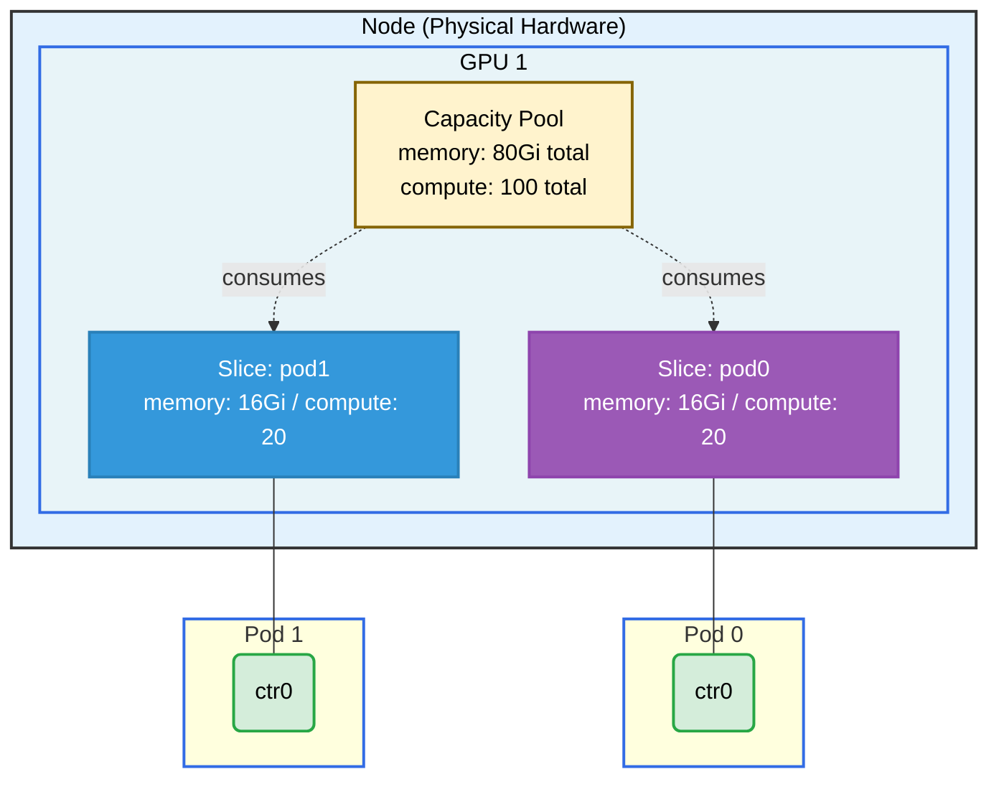

# GPU Allow Multiple Allocations Example

## Overview

This example demonstrates the **DRAConsumableCapacity** feature, which allows multiple pods to share a single GPU by consuming slices of its capacity. Each pod requests a portion of the GPU's `memory` and `compute` counters from the same physical device simultaneously.

**Setup**: Two pods, each with one container, each consuming 16Gi memory and 20 compute units from the same GPU.

## What This Example Shows

- How to use `capacity.requests` in a ResourceClaim to consume a slice of a device's capacity
- Multiple pods sharing a single GPU via `AllowMultipleAllocations`
- The `DRAConsumableCapacity` feature gate in practice

## GPU Allocation



## Requirements

### Driver Requirements

- **Profile**: gpu
- **GPUs**: 1
- Helm value: `gpuAllowMultipleAllocations=true`

### Cluster Requirements

- Kubernetes 1.35+
- Feature gate: `DRAConsumableCapacity` (Alpha in 1.35, enabled by default in 1.36+)

## Prerequisites

Install the driver with multiple allocations enabled:

```bash
helm upgrade -i \
  --create-namespace \
  --namespace dra-example-driver \
  --set gpuAllowMultipleAllocations=true \
  dra-example-driver \
  deployments/helm/dra-example-driver
```

## How to Run

1. Apply the example:

   ```bash
   cd demo/examples/gpu-allow-multiple-allocations && kubectl apply -f gpu-allow-multiple-allocations.yaml
   ```

2. Verify both pods are running:

   ```bash
   kubectl get pods -n gpu-allow-multiple-allocations
   ```

3. Check GPU allocation for both pods:

   ```bash
   kubectl logs -n gpu-allow-multiple-allocations pod0 -c ctr0 | grep GPU_DEVICE
   kubectl logs -n gpu-allow-multiple-allocations pod1 -c ctr0 | grep GPU_DEVICE
   ```

## Expected Output

Both pods should show the **same** GPU ID, confirming they are sharing the same physical GPU, each consuming their requested capacity slice.

Example output:

```
# Pod pod0
GPU_DEVICE_0=gpu-0

# Pod pod1
GPU_DEVICE_0=gpu-0
```

## Cleanup

```bash
cd demo/examples/gpu-allow-multiple-allocations && kubectl delete -f gpu-allow-multiple-allocations.yaml
```
