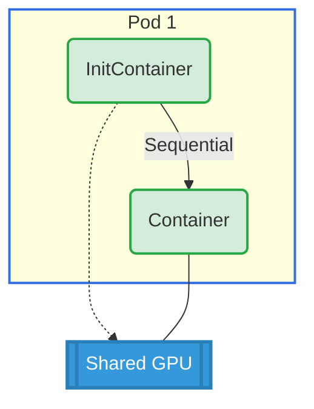

# InitContainer Shared GPU Example

## Overview

This example demonstrates GPU sharing between an initContainer and a regular container within the same pod. Both containers reference the same ResourceClaim, allowing the initContainer to perform GPU-based initialization before the main container runs.

**Setup**: One pod with one initContainer and one container sharing access to a single GPU.

## GPU Allocation



## Requirements

### Driver Requirements
- **Profile**: gpu
- **GPUs**: 1

### Cluster Requirements
- Kubernetes 1.34+

## How to Run

1. Apply the example:
   ```bash
   cd demo/examples/initcontainer-shared-gpu && kubectl apply -f initcontainer-shared-gpu.yaml
   ```

2. Verify the pod is running:
   ```bash
   kubectl get pods -n initcontainer-shared-gpu
   ```

3. Check GPU allocation for both initContainer and container:
   ```bash
   # InitContainer logs
   kubectl logs -n initcontainer-shared-gpu pod0 -c init0 | grep GPU_DEVICE
   
   # Main container logs
   kubectl logs -n initcontainer-shared-gpu pod0 -c ctr0 | grep GPU_DEVICE
   ```

## Expected Output

Both the initContainer and main container should show the same GPU ID, confirming they share access to the same GPU.

Example output:
```bash
# InitContainer init0
GPU_DEVICE_0=gpu-0

# Container ctr0
GPU_DEVICE_0=gpu-0
```

## Cleanup

```bash
cd demo/examples/initcontainer-shared-gpu && kubectl delete -f initcontainer-shared-gpu.yaml
```
