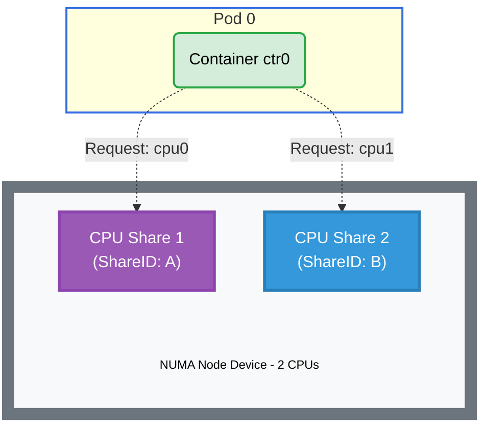

# Native Resource Request Example

## Overview

This example demonstrates how to use Dynamic Resource Allocation (DRA) to manage native (node-allocatable) CPU resources with consumable capacity sharing. The driver publishes one device per fake NUMA node, each exposing its CPU count as consumable capacity. A single pod makes two CPU requests that are both satisfied by the same NUMA device through capacity sharing.

**Setup**: One pod with one container requesting 2 CPUs (via two separate 1-CPU requests) from a single NUMA node device.

## CPU Allocation



## Requirements

### Driver Requirements

- **Profile**: cpu (not the default gpu profile)
- **NUMA nodes**: 1
- **CPUs per NUMA node**: 2 or more

### Cluster Requirements

- Kubernetes 1.36+
- Feature gates: `DRANodeAllocatableResources`, `DRAConsumableCapacity`

## How to Run

### 1. Install the Driver with CPU Profile

This example requires a separate driver installation with the `cpu` profile:

```bash
helm upgrade -i \
  --create-namespace \
  --namespace dra-example-driver-cpu \
  --set deviceProfile=cpu \
  --set kubeletPlugin.cpu.numaNodes=1 \
  --set kubeletPlugin.cpu.cpusPerNUMANode=2 \
  dra-example-driver-cpu \
  deployments/helm/dra-example-driver
```

**Configuration Notes**:

- `kubeletPlugin.cpu.numaNodes`: Number of fake NUMA-node devices the driver advertises
- `kubeletPlugin.cpu.cpusPerNUMANode`: CPU capacity each NUMA node exposes
- A single 2-CPU NUMA node satisfies both 1-CPU requests from one device

### 2. Apply the Example

```bash
cd demo/examples/native-resource-request && kubectl apply -f native-resource-request.yaml
```

### 3. Verify the Pod is Running

```bash
kubectl get pods -n native-resource-request
```

### 4. Check Resource Allocation

View the node allocatable resource claim status:

```bash
kubectl get pod -n native-resource-request pod0 \
  -o jsonpath='{.status.nodeAllocatableResourceClaimStatuses}' | jq
```

View the ResourceClaim allocation details:

```bash
kubectl get resourceclaims -n native-resource-request \
  -o jsonpath='{range .items[*].status.allocation.devices.results[*]}{.device}{" "}{.shareID}{"\n"}{end}'
```

View the generated ResourceClaim:

```bash
kubectl get resourceclaims -n native-resource-request
```

## Expected Output

- **Pod Status**: The pod should be running successfully
- **CPU Allocation**: The status should include `cpu: "2"` for the generated claim
- **Device Sharing**: Both allocation results should reference the same NUMA device but with different ShareIDs
- **Claim Name**: The `resourceClaimName` in the status is the template-generated concrete claim name (e.g., `pod0-cpus-xxxxx`), not the pod-local name `cpus`

Example allocation output:

```
numa-node-0 share-id-1
numa-node-0 share-id-2
```

Both requests are satisfied by the same device (`numa-node-0`) but with distinct ShareIDs, demonstrating consumable capacity sharing.

## Cleanup

```bash
cd demo/examples/native-resource-request && kubectl delete -f native-resource-request.yaml
```

To uninstall the CPU driver:

```bash
helm uninstall -n dra-example-driver-cpu dra-example-driver-cpu
```
