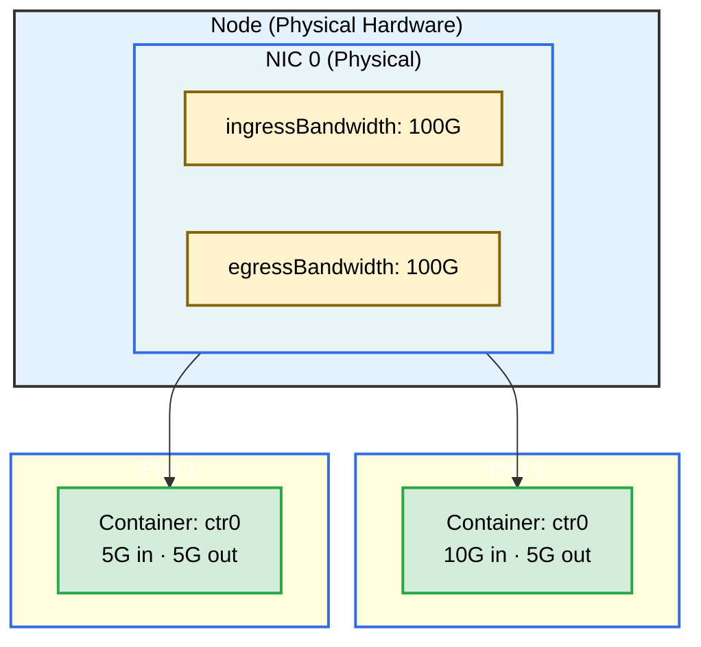

# NIC Consumable Capacity Example

## Overview

This example demonstrates the **DRAConsumableCapacity** feature with network devices. Two pods each request a NIC (Network Interface Card) with specific ingress and egress bandwidth. Because each NIC exposes 100Gbps of capacity in each direction, both pods can be allocated to the **same physical NIC** — the scheduler tracks and deducts the bandwidth consumed by each allocation.

**Setup**: Two pods, one container each. `pod0` requests 10Gbps ingress / 5Gbps egress. `pod1` requests 5Gbps ingress / 5Gbps egress.

## Overview



## Requirements

### Cluster Requirements
- **Kubernetes 1.35+** with the `DRAConsumableCapacity` feature gate enabled

### Driver Requirements
- **Profile**: `net`
- **NICs**: 1 (a single NIC with 100G capacity is enough for both pods)

## Prerequisites

Install the driver with the `net` profile:

```bash
helm upgrade -i \
  --create-namespace \
  --namespace dra-example-driver \
  --set deviceProfile=net \
  --set kubeletPlugin.numDevices=1 \
  dra-example-driver \
  deployments/helm/dra-example-driver
```

## Verification

### Check ResourceSlices

The NIC device should advertise `ingressBandwidth` and `egressBandwidth` consumable capacity:

```bash
kubectl get resourceslices -o wide
```

## Running the Example

Apply the example:

```bash
cd demo/examples/net-consumable-capacity && kubectl apply -f net-consumable-capacity.yaml
```

Verify both pods are running:

```bash
kubectl get pods -n net-consumable-capacity
```

## Expected Output

Check that each pod received the bandwidth it requested:

```bash
kubectl logs -n net-consumable-capacity pod0 -c ctr0 | grep NET_DEVICE
kubectl logs -n net-consumable-capacity pod1 -c ctr0 | grep NET_DEVICE
```

Each container should have `NET_DEVICE_<N>_INGRESS_RATE` and `NET_DEVICE_<N>_EGRESS_RATE` environment variables reflecting the allocated bandwidth in bits per second. For example:

```
declare -x NET_DEVICE_0_INGRESS_RATE="10000000000"
declare -x NET_DEVICE_0_EGRESS_RATE="5000000000"
```

Both pods may reference the same physical NIC index (`0`), confirming that a single device is shared across multiple allocations with individual bandwidth guarantees tracked by the scheduler.

## Cleanup

```bash
cd demo/examples/net-consumable-capacity && kubectl delete -f net-consumable-capacity.yaml
```

To uninstall the driver:

```bash
helm uninstall -n dra-example-driver dra-example-driver
```
