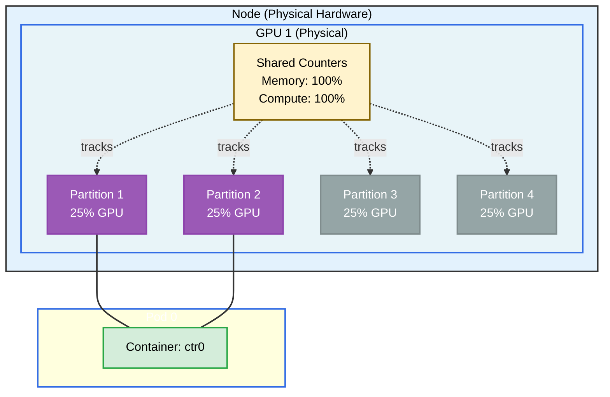

# Partitionable Devices Example

This example demonstrates the **DRAPartitionableDevices** feature, which allows GPUs to be exposed with shared counters enabling flexible partitioning.

- Each physical GPU has a **counter set** (memory and compute)
- Multiple **partition devices** consume from those counters
- A full-GPU device is also available that consumes all counters
- The scheduler uses shared counters to track that partitions share GPU resources

**Setup**: One pod with one container requesting 2 GPU partitions from the same physical GPU.

## Overview



## Requirements

### Cluster Requirements
- **Kubernetes 1.35+** with `DRAPartitionableDevices` feature gate enabled
  - Beta in Kubernetes 1.35
  - Enabled by default in Kubernetes 1.36+

### Driver Requirements
- Profile: `gpu`
- Helm values: `kubeletPlugin.gpuPartitions=4`

## Prerequisites

Install the driver with partitioning enabled:

```bash
helm upgrade -i \
  --create-namespace \
  --namespace dra-example-driver \
  --set kubeletPlugin.gpuPartitions=4 \
  --set kubeletPlugin.numDevices=2 \
  dra-example-driver \
  deployments/helm/dra-example-driver
```
## Verification

### Check ResourceSlices
You should see two slices per node — one for shared counters and one for partition devices:

```bash
kubectl get resourceslices -o wide
```

## Running the Example

Apply the example:

```bash
cd demo/examples/partitionable-devices && kubectl apply -f partitionable-devices.yaml
```

## Expected Output
Check that pod0 gets two GPU partitions:

```bash
kubectl logs -n partitionable-devices pod0 -c ctr0 | grep GPU_DEVICE
```

Expected output should show two GPU partition devices allocated to the container.

## Cleanup

```bash
cd demo/examples/partitionable-devices && kubectl delete -f partitionable-devices.yaml
```
