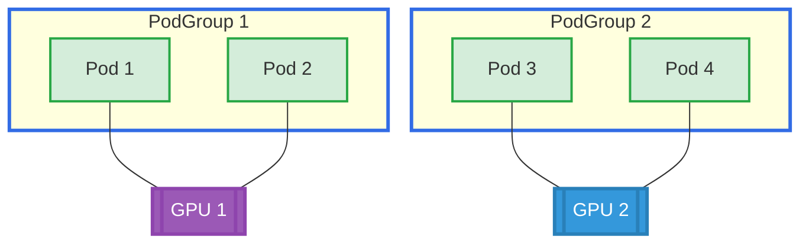

# PodGroup ResourceClaimTemplate Example

## Overview

This example demonstrates gang scheduling with DRA using PodGroups. Multiple pods within a PodGroup share the same GPU, and all pods in the group are scheduled together (all-or-nothing). This example creates two separate PodGroups, each with its own shared GPU.

**Setup**: Two PodGroups with multiple pods each, where all pods in a group share one GPU.

## GPU Allocation



## Requirements

### Driver Requirements
- **Profile**: gpu
- **GPUs**: 2

### Cluster Requirements
- Kubernetes 1.36+
- API: `scheduling.k8s.io/v1alpha2` enabled
- Feature gates:
  - `GenericWorkload`
  - `GangScheduling`
  - `DRAWorkloadResourceClaims`

## How to Run

1. Apply the example:
   ```bash
   cd demo/examples/podgroup-resourceclaimtemplate && kubectl apply -f podgroup-resourceclaimtemplate.yaml
   ```

2. Verify all pods are running:
   ```bash
   kubectl get pods -n podgroup-resourceclaimtemplate
   ```

3. Check GPU allocation for each PodGroup:
   ```bash
   # PodGroup 1 - all pods should show the same GPU
   kubectl logs -n podgroup-resourceclaimtemplate --tail=-1 -l app=group-1 | grep GPU_DEVICE
   
   # PodGroup 2 - all pods should show the same GPU (different from group-1)
   kubectl logs -n podgroup-resourceclaimtemplate --tail=-1 -l app=group-2 | grep GPU_DEVICE
   ```

## Expected Output

### PodGroup 1
All pods in group-1 should show the same GPU ID:
```
GPU_DEVICE_0=gpu-0
GPU_DEVICE_0=gpu-0
```

### PodGroup 2
All pods in group-2 should show the same GPU ID (different from group-1):
```
GPU_DEVICE_0=gpu-1
GPU_DEVICE_0=gpu-1
```

## Cleanup

```bash
cd demo/examples/podgroup-resourceclaimtemplate && kubectl delete -f podgroup-resourceclaimtemplate.yaml
```