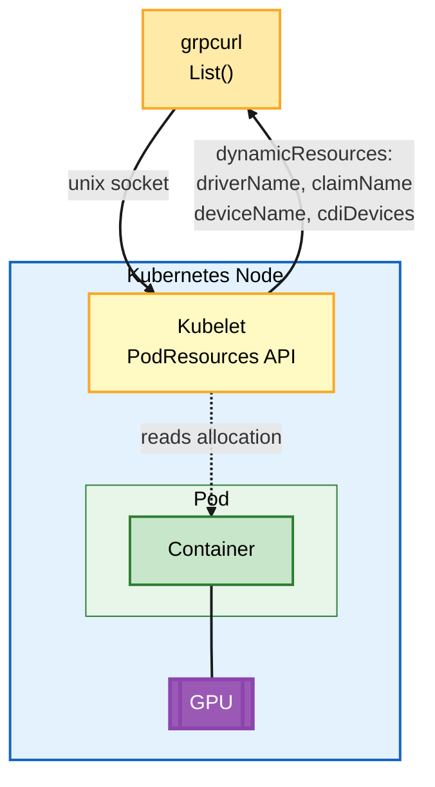

# PodResources API Example

## Overview

This example demonstrates how to query the kubelet **PodResources gRPC API** to discover DRA-allocated devices for running pods. This feature is part of [KEP-3695](https://github.com/kubernetes/enhancements/issues/3695), which extends the PodResources API to include resources allocated by DRA drivers.

**Feature Status**:

- **Beta** in Kubernetes 1.34
- **Stable** in Kubernetes 1.36+

**Setup**: One pod requesting a GPU through DRA, with options to query the PodResources API to see the allocated device.

## Architecture



## Requirements

### Cluster Requirements

- **Kubernetes 1.34+** (Beta feature)
- **Kubernetes 1.36+** (Stable, enabled by default)
- For Kubernetes 1.34-1.35, ensure the feature gate is enabled (it's enabled by default in Beta)

### Driver Requirements

- **Profile**: `gpu` (default)
- **GPUs**: 1 minimum

## How to Run

### 1. Install the Driver

```bash
go tool -modfile hack/tools/go.mod helm upgrade -i \
  --create-namespace \
  --namespace dra-example-driver \
  dra-example-driver \
  deployments/helm/dra-example-driver
```

Expected output:

```
NAME: dra-example-driver
LAST DEPLOYED: <date>
NAMESPACE: dra-example-driver
STATUS: deployed
REVISION: 1
DESCRIPTION: Install complete
```

### 2. Apply the Example

```bash
kubectl apply -f demo/examples/podresources-api/podresources-api.yaml
```

Expected output:

```
namespace/podresources-api created
resourceclaimtemplate.resource.k8s.io/gpu-claim created
pod/workload-pod created
```

### 3. Verify the Pod is Running

```bash
kubectl get pods -n podresources-api
```

Wait until `workload-pod` reaches `Running` state.

### 4. Query the PodResources API

For kind clusters, exec directly into the worker node container and query the socket from there. Because the kubelet gRPC server does not have reflection enabled, you must supply the proto file explicitly.

> **Note**: Use `docker exec` instead of `podman exec` if your kind cluster uses Docker.

```bash
# Exec into the kind worker node
podman exec -it dra-example-driver-cluster-worker bash

# Inside the node: install grpcurl
curl -sSL https://github.com/fullstorydev/grpcurl/releases/download/v1.9.1/grpcurl_1.9.1_linux_x86_64.tar.gz \
  | tar -xz -C /usr/local/bin grpcurl

# Download the proto file
mkdir -p /tmp/podresources
curl -sSL https://raw.githubusercontent.com/kubernetes/kubernetes/master/staging/src/k8s.io/kubelet/pkg/apis/podresources/v1/api.proto \
  -o /tmp/podresources/api.proto

# Query the API and filter for the workload pod
grpcurl -plaintext \
  -unix \
  -import-path /tmp/podresources \
  -proto /tmp/podresources/api.proto \
  /var/lib/kubelet/pod-resources/kubelet.sock \
  v1.PodResourcesLister/List | grep -A 25 "workload-pod"
```

---

## Expected Output

The PodResources API returns a JSON response containing all pods on the node. The `workload-pod` entry will show the DRA-allocated GPU under `dynamicResources`:

```json
{
  "name": "workload-pod",
  "namespace": "podresources-api",
  "containers": [
    {
      "name": "workload",
      "dynamicResources": [
        {
          "claimName": "workload-pod-gpu-<suffix>",
          "claimNamespace": "podresources-api",
          "claimResources": [
            {
              "cdiDevices": [
                {
                  "name": "k8s.gpu.example.com/gpu=common"
                },
                {
                  "name": "k8s.gpu.example.com/gpu=<uuid>-gpu-0"
                }
              ],
              "driverName": "gpu.example.com",
              "poolName": "<node-name>",
              "deviceName": "gpu-0"
            }
          ]
        }
      ]
    }
  ]
}
```

### Key Fields Explained (KEP-3695)

| Field                         | Description                                                                                          |
| ----------------------------- | ---------------------------------------------------------------------------------------------------- |
| `dynamicResources`            | Array of DRA-allocated resources — new in KEP-3695; absent on pre-1.34 clusters                      |
| `claimName`                   | Name of the `ResourceClaim` bound to the pod (includes a random suffix when created from a template) |
| `claimNamespace`              | Namespace of the `ResourceClaim`                                                                     |
| `claimResources[].driverName` | The DRA driver that allocated the device (e.g. `gpu.example.com`)                                    |
| `claimResources[].poolName`   | The node the device lives on                                                                         |
| `claimResources[].deviceName` | The allocated device ID (e.g. `gpu-0`)                                                               |
| `claimResources[].cdiDevices` | CDI identifiers injected into the container environment                                              |

## Cleanup

```bash
kubectl delete -f demo/examples/podresources-api/podresources-api.yaml
go tool -modfile hack/tools/go.mod helm uninstall dra-example-driver -n dra-example-driver
```
