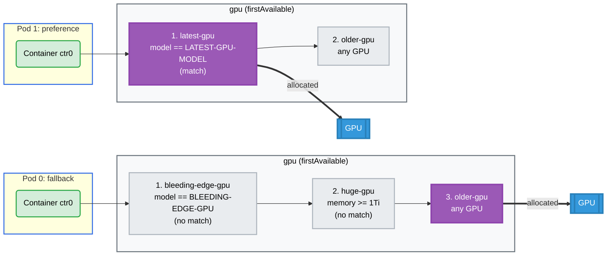

# Prioritized Alternatives Example

## Overview

This example demonstrates prioritized alternatives in device requests
([KEP-4816](https://github.com/kubernetes/enhancements/issues/4816)). A single
`DeviceRequest` lists several ways to satisfy itself in priority order via the
`firstAvailable` field. The scheduler tries each subrequest in turn and
allocates the first one that can be satisfied, letting a workload prefer a
high-end device but still run on a less specialized one when the preferred
options are unavailable.

**Setup**: Two pods, each making a single `gpu` request that offers a prioritized
list of alternatives (subrequests), not separate GPUs.

- **pod0 (fallback)**: the first two subrequests carry a CEL selector that no
  device can satisfy, so the request falls through to the third.
- **pod1 (preference)**: both subrequests can be satisfied, so the scheduler
  picks the higher-priority one.

## GPU Allocation



## How It Works

Each subrequest is matched against the GPU devices that the example driver
advertises. The driver
([`internal/profiles/gpu/gpu.go`](../../../internal/profiles/gpu/gpu.go))
publishes every GPU with a `model` attribute of `LATEST-GPU-MODEL` and a `memory`
capacity of `80Gi`. The subrequests filter on those values using CEL selectors,
and the scheduler uses the first subrequest that can be satisfied.

**pod0 — fallback.** The first two selectors match no device, so `firstAvailable`
falls through to `older-gpu`:

| # | Subrequest | Selector | Devices matched | Result |
| - | ---------- | -------- | --------------- | ------ |
| 1 | `bleeding-edge-gpu` | `model == 'BLEEDING-EDGE-GPU'` | 0 (every GPU is `LATEST-GPU-MODEL`) | skipped |
| 2 | `huge-gpu` | `memory >= 1Ti` | 0 (every GPU is `80Gi`) | skipped |
| 3 | `older-gpu` | none | any GPU | **allocated** |

**pod1 — preference.** Both subrequests can be satisfied, so the higher-priority
one wins even though the lower-priority one would also work:

| # | Subrequest | Selector | Devices matched | Result |
| - | ---------- | -------- | --------------- | ------ |
| 1 | `latest-gpu` | `model == 'LATEST-GPU-MODEL'` | any GPU | **allocated** |
| 2 | `older-gpu` | none | any GPU | not reached |

The selectors compare against attributes and capacities the driver advertises,
not anything defined in the claim. A subrequest whose selector matches zero
devices cannot be satisfied, so the scheduler moves on to the next one in the
list.

## Requirements

### Driver Requirements

- **Profile**: gpu
- **GPUs**: 2 (one per pod)

### Cluster Requirements

- **Kubernetes 1.34+** with the `DRAPrioritizedList` feature gate enabled
  - Beta and enabled by default in Kubernetes 1.34–1.35
  - GA in Kubernetes 1.36+

## How to Run

1. Apply the example:

   ```bash
   cd demo/examples/prioritized-alternatives && kubectl apply -f prioritized-alternatives.yaml
   ```

2. Verify the pods are running:

   ```bash
   kubectl get pods -n prioritized-alternatives
   ```

3. Check a GPU was injected into each container:

   ```bash
   kubectl logs -n prioritized-alternatives pod0 -c ctr0 | grep GPU_DEVICE
   kubectl logs -n prioritized-alternatives pod1 -c ctr0 | grep GPU_DEVICE
   ```

4. Check which subrequest the scheduler chose for each pod:

   ```bash
   kubectl get resourceclaim -n prioritized-alternatives \
     -o jsonpath='{range .items[*]}{.status.allocation.devices.results[*].request}{"\n"}{end}'
   ```

## Expected Output

- **Pod Status**: Both pods should be running successfully.
- **GPU Allocation**: Each container has exactly one `GPU_DEVICE` environment
  variable, and the two pods get distinct GPUs.
- **Chosen Subrequest**: The allocation results reference the chosen subrequest
  using the `<main request>/<subrequest>` format:

  ```
  gpu/older-gpu     # pod0 fell back to the only satisfiable subrequest
  gpu/latest-gpu    # pod1 preferred the higher-priority subrequest
  ```

## Cleanup

```bash
cd demo/examples/prioritized-alternatives && kubectl delete -f prioritized-alternatives.yaml
```
