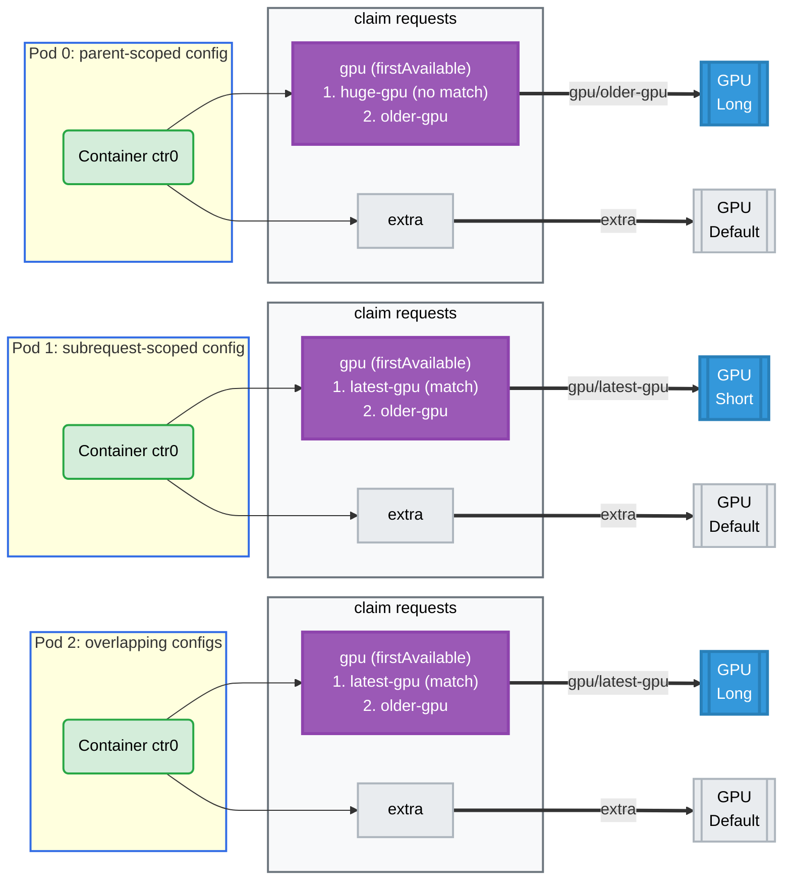

# Subrequest Config Scoping Example

## Overview

This example demonstrates how an opaque device config's `requests` scoping
interacts with prioritized alternatives
([KEP-4816](https://github.com/kubernetes/enhancements/issues/4816)). When a
request is satisfied through a `firstAvailable` list, the allocation result
records the chosen subrequest as `<request>/<subrequest>` (e.g.
`gpu/older-gpu`). A config can name either the parent request or the full
subrequest reference, and the driver has to reconcile the two.

**Setup**: Three pods, each with a claim making **two** device requests — a
`gpu` request offering a prioritized list, and an ordinary `extra` request.

- **pod0**: config scoped to the parent request `gpu`.
- **pod1**: config scoped to the full subrequest reference `gpu/latest-gpu`,
  plus one scoped to the subrequest that is not chosen.
- **pod2**: two configs that both match, to pin down which one wins.

## Why the Second Request Matters

The `extra` request is not decoration — without it this example would prove
nothing.

The allocator copies a claim's configs into `status.allocation.devices.config`,
and clears a config's `requests` field when that config applies to *every*
request in the claim, "to take advantage of the `empty means all` semantic". A
claim with a single `gpu` request hits that case: the surviving config comes
back with `requests: null`, and any driver applies it to everything regardless
of how it matches request names.

Adding a second request defeats the clearing. The config stays scoped to
`["gpu"]` in the allocation result while the result it must apply to reports
its request as `gpu/older-gpu`, so the driver is the one that has to relate the
two. That is the behavior this example pins down.

## GPU Allocation



## How It Works

**pod0 — parent-scoped.** The `huge-gpu` subrequest selects on `memory >= 1Ti`
and the driver publishes `80Gi`, so the request falls through to `older-gpu`.

| Config `requests` | Allocation result request | Applies? |
| ----------------- | ------------------------- | -------- |
| `["gpu"]` | `gpu/older-gpu` | **yes** — the parent request covers its subrequests |
| `["gpu"]` | `extra` | no — a different request |

**pod1 — subrequest-scoped.** Every device matches `latest-gpu`, so the
higher-priority subrequest is chosen.

| Config `requests` | Allocation result request | Applies? |
| ----------------- | ------------------------- | -------- |
| `["gpu/latest-gpu"]` | `gpu/latest-gpu` | **yes** — exact reference |
| `["gpu/latest-gpu"]` | `extra` | no — a different request |
| `["gpu/older-gpu"]` | — | never reaches the driver; the allocator omits configs scoped to an unchosen subrequest |

**pod2 — precedence.** Both configs match the chosen `gpu/latest-gpu` result.

| # | Config `requests` | Interval | Wins? |
| - | ----------------- | -------- | ----- |
| 1 | `["gpu/latest-gpu"]` | `Short` | no — matched, but shadowed |
| 2 | `["gpu"]` | `Long` | **yes** — last match in precedence order |

Matching carries no specificity ranking. The API defines which configs apply to
a result and leaves resolution to the driver; this example driver applies the
last matching config in its precedence order — claim configs over device class
configs, and later entries over earlier ones within each — so the parent-scoped
config wins here purely by being listed second. A different driver may merge
matching configs rather than pick one.

A device that no config applies to gets the driver's default `GpuConfig`, which
is why every `extra` device reports `TIMESLICE_INTERVAL=Default`.

## Requirements

### Driver Requirements

- **Profile**: gpu
- **GPUs**: 6 (2 per pod)

### Cluster Requirements

- **Kubernetes 1.34+** with the `DRAPrioritizedList` feature gate enabled
  - Beta and enabled by default in Kubernetes 1.34–1.35
  - GA in Kubernetes 1.36+

## How to Run

1. Apply the example:

   ```bash
   cd demo/examples/subrequest-config-scoping && kubectl apply -f subrequest-config-scoping.yaml
   ```

2. Verify the pods are running:

   ```bash
   kubectl get pods -n subrequest-config-scoping
   ```

3. Check the GPUs and their intervals:

   ```bash
   kubectl logs -n subrequest-config-scoping pod0 -c ctr0 | grep GPU_DEVICE
   kubectl logs -n subrequest-config-scoping pod1 -c ctr0 | grep GPU_DEVICE
   kubectl logs -n subrequest-config-scoping pod2 -c ctr0 | grep GPU_DEVICE
   ```

4. Check which request each device was allocated for, and that the config
   scoping survived into the allocation result:

   ```bash
   kubectl get resourceclaim -n subrequest-config-scoping \
     -o jsonpath='{range .items[*]}{.status.allocation.devices.results[*].request}{"\n"}{end}'
   kubectl get resourceclaim -n subrequest-config-scoping \
     -o jsonpath='{range .items[*]}{.status.allocation.devices.config[*].requests}{"\n"}{end}'
   ```

## Expected Output

- **Pod Status**: All three pods should be running successfully.
- **GPU Allocation**: Each container has two `GPU_DEVICE` environment
  variables, and all six GPUs are distinct.
- **Allocation Results**: The prioritized request reports the chosen
  subrequest, alongside the plain `extra` request:

  ```
  gpu/older-gpu extra     # pod0
  gpu/latest-gpu extra    # pod1
  gpu/latest-gpu extra    # pod2
  ```

- **Preserved Scoping**: The configs keep their `requests` field, rather than
  being cleared to "applies to all":

  ```
  ["gpu"]
  ["gpu/latest-gpu"]
  ["gpu/latest-gpu"] ["gpu"]
  ```

- **Applied Intervals**: For each pod, the GPU allocated to the `gpu` request
  carries the config's interval and the GPU allocated to `extra` falls back to
  the default:

  ```
  pod0: gpu -> TIMESLICE_INTERVAL=Long   extra -> TIMESLICE_INTERVAL=Default
  pod1: gpu -> TIMESLICE_INTERVAL=Short  extra -> TIMESLICE_INTERVAL=Default
  pod2: gpu -> TIMESLICE_INTERVAL=Long   extra -> TIMESLICE_INTERVAL=Default
  ```

## Cleanup

```bash
cd demo/examples/subrequest-config-scoping && kubectl delete -f subrequest-config-scoping.yaml
```
